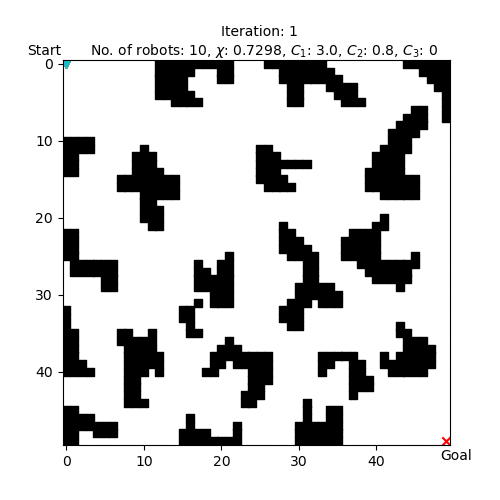
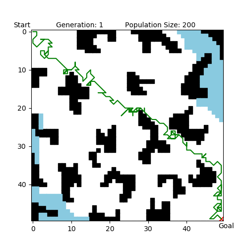

# sar_swarm
Investigation and simulation of carrying search and rescue missions with a hybrid algorithm: using Particle Swarm Optimisation (PSO) algorithm for target searching and Genetic Algorithm (GA) for shortest path planning.

